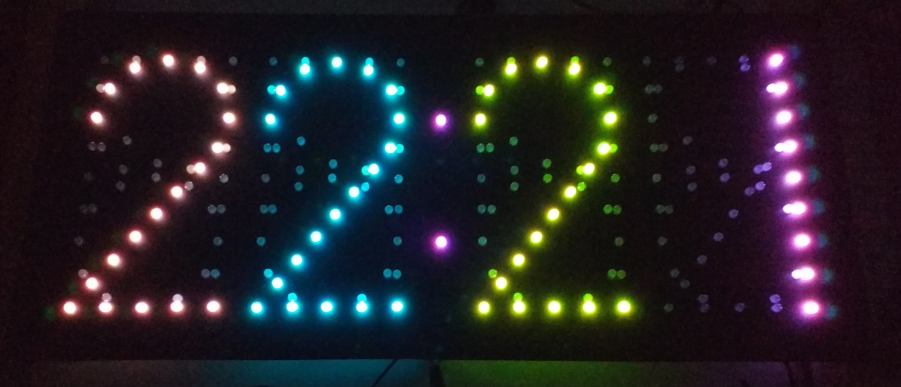

# Project Fancy Clock

The Fancy Clock is a Arduino Nano v3 [1] based radio controlled clock [2] that displays the time colorful and is capable of using various effects like fading and random colors.

The clock utilizes 196 WS2812 compatible LEDs (PL9823 F5) which are basically ICs with a red, green and blue LED each in a transparent common 5 mm LED housing. Each LED has an data in and an data out pin. The LEDs are connected in an daisy chain manner with the first LED connected with its data in pin to the controller. Like that all LEDs can be controlled individually using only one singe output pin of the controller.

[1]: The project doesn't utilize the Arduino library (only adapts small pieces of it's code) but uses the Arduino boot loader to comfortable program the controller.

[2]: This means the clock get's synchronized by [DFC77](https://en.wikipedia.org/wiki/DCF77).

## State of the project

This project is a work in progress. I am working on this project in my spare time, so the project evolves only slowly.

**TODOs**
* Add more documentation like a schematic
* Implement auto effect switching
* Implement one or two more effects
* Build a housing for the clock
* Enhance this readme
* ...
